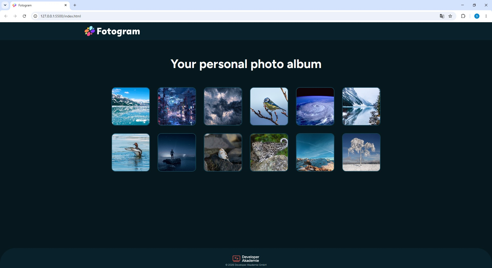

# 📸 Fotogram

A responsive photo gallery built with **HTML, CSS and JavaScript**. Users can browse image thumbnails, open them in a full-screen modal and navigate through the gallery using buttons or keyboard controls.

---

## ✨ Features

- 📷 Dynamic image rendering with JavaScript
- 🖼️ Responsive photo gallery
- 🔍 Fullscreen image preview using the HTML `<dialog>` element
- ⬅️➡️ Previous & Next image navigation
- ⌨️ Close dialog with **ESC**
- 🖱️ Close dialog by clicking outside the image
- 📱 Responsive layout for desktop and mobile devices
- ♿ Basic accessibility support (ARIA labels & keyboard navigation)

---

## 🛠️ Built With

- HTML5
- CSS3
- JavaScript (ES6)

---

## 📂 Project Structure

```
Fotogram/
│
├── assets/
│   ├── icon/
│   ├── img/
│   └── media/
│
├── index.html
├── README.md
├── style.css
├── script.js
└── templateFunction.js
```

---

## 🚀 Getting Started

Clone the repository:

```bash
git clone https://github.com/SaschaWinter/Fotogram.git
```

Open the project folder and start `index.html` in your browser.

---

## 📸 Preview



---

## 🎯 Learning Goals

This project was created as part of the **Developer Akademie Fullstack Developer Bootcamp**.

Main focus:

- DOM Manipulation
- Arrays & Objects
- Functions
- Template Rendering
- Event Handling
- Responsive Web Design
- Clean Code Principles

---

## 👨‍💻 Author

**Sascha Winter**

GitHub:
https://github.com/SaschaWinter
